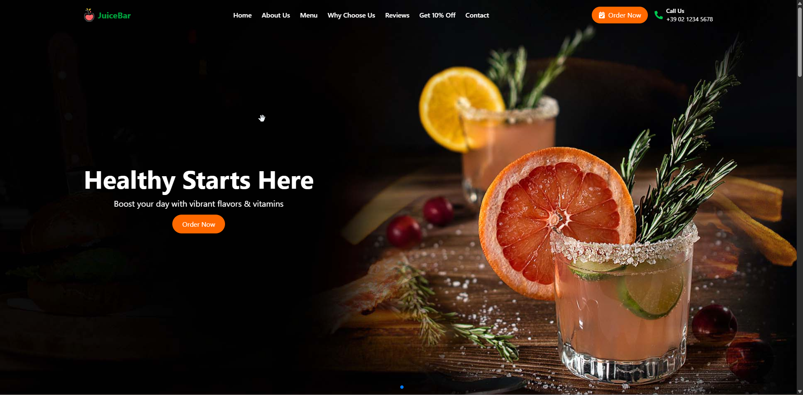

## 🧃 JuiceBar Landing Page - Ratul Ali

A clean, responsive, SEO-friendly landing page for a fictional fresh juice business. Built with **React + Vite**, styled using **Tailwind CSS**, and enhanced with **AOS scroll animations** and `react-helmet` for SEO.



## 🚀 Features

* 🌿 Clean, modern design with mobile-first responsiveness
* 🖼️ Hero slider with Swiper + flip effect
* 🧾 About, Menu, Benefits, Testimonials, Newsletter & Contact sections
* ✨ Scroll-based animations with AOS
* 🧠 SEO-friendly via `react-helmet`
* 📫 Newsletter signup (Mailchimp or CSV export supported)
* 📍 Google Maps embed for location
* 🔗 Social footer with legal links

## 🛠 Tech Stack

| Tool         | Purpose                      |
| ------------ | ---------------------------- |
| React + Vite | Frontend framework & tooling |
| Tailwind CSS | Utility-first styling        |
| AOS          | Scroll-triggered animations  |
| Swiper       | Hero image slider            |
| react-helmet | SEO metadata injection       |


## 📦 Installation

1. **Download** and extract the `.zip` file.
2. **Open a terminal** in the project directory.
3. Run the following commands:

```bash
npm install
npm run dev
```

4. Open your browser and go to:
   👉 [http://localhost:5173](http://localhost:5173)


## 📁 Folder Structure

```
src/
  ├── components/
  │   ├── Header.tsx
  │   ├── HeroSlider.tsx
  │   ├── AboutUs.tsx
  │   ├── OurJuices.tsx
  │   ├── WhyChooseUs.tsx
  │   ├── Testimonials.tsx
  │   ├── NewsletterSignup.tsx
  │   ├── ContactSection.tsx
  │   └── Footer.tsx
  ├── App.tsx
  └── main.tsx
public/
  └── assets/images/  ← All juice/product/customer images
```

## 🔍 SEO Tips

* `react-helmet` is used in `App.tsx` to inject dynamic `<title>`, `<meta>`, and Open Graph tags.
* In this Vite-based SPA, these tags are **inserted at runtime**, which means:

  * ✅ Useful for basic SEO (Google indexing, document titles)
  * ❌ May not show up for social media bots or non-JS crawlers
* If you plan to use **pre-rendering or static site generation (SSG)** with Vite (e.g., via `vite-plugin-ssr` or `react-snap`), then `react-helmet` **will enhance** the output and **be SEO-visible** in the HTML.

> For best results with full SEO (especially for social sharing), consider using **Next.js** or Vite with **SSR/SSG support**.


## 📬 Newsletter Setup

* 🔗 **Mailchimp**: This project uses a test Mailchimp form URL.  
  ✅ To make it functional, replace the `action` value in `NewsletterSignup.tsx` with your real Mailchimp list form URL.
  You can find it in Mailchimp under:  
  **Audience → Signup forms → Embedded form → Copy action URL**

* 💡 You can also connect to other services (Formspree, EmailJS) or export emails to CSV if needed.


## 🧪 Accessibility & Performance
* ✅ Semantic HTML with WCAG-friendly labels
* ✅ Tailwind for responsive typography and layout
* ✅ Animations optimized for smooth load with fallback
* ✅ Lighthouse-checked for speed and accessibility


## 🚀 Deployment

This project is production-ready and can be deployed to:

- 🔗 [Netlify](https://netlify.com)
- 🔗 [Vercel](https://vercel.com)
- 🖥️ Any static web server (e.g., Nginx, Firebase Hosting)

To build for production:

```bash
npm run build
```

Then deploy the contents of the `dist/` folder.

To preview locally:

```bash
npm run preview
```
